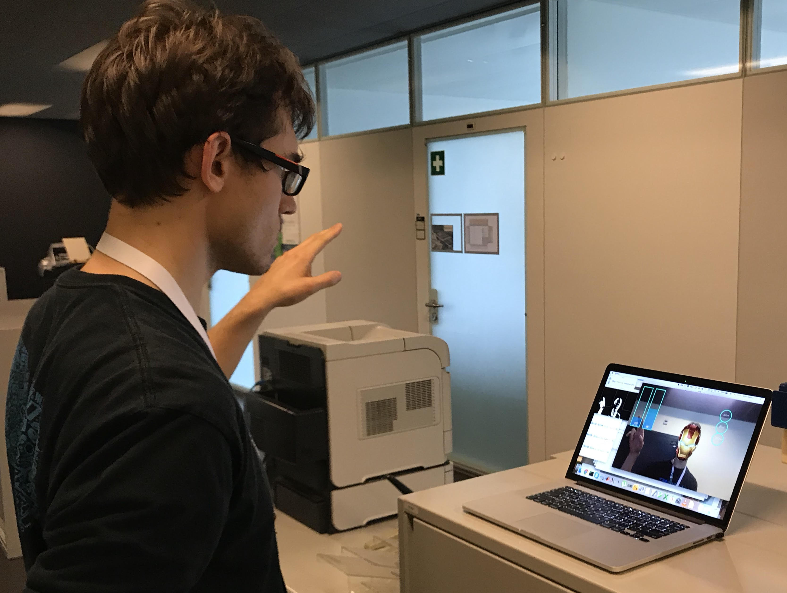

# Iron Man Manipulator

## Inspiration
In scenarios where you don't have access to mouse & keyboard, one way to manipulate a computer/TV is by using gestures captured by the camera. This is often portrayed in sci-fi movies (including "Iron Man"), but is quite hard to implement. We decided to give it a try :)

## What it does
Our project allows us to recognize over 5 different gestures. We bound some of them to actions on the computer, such as changing the volume or brightness. Additionally, we provide an AR-like experience for easier interaction. And since we are using a webcam, why not build a couple of trendy face filters, such as an Iron Man mask.

## How we built it
In python with using OpenCV, with most algorithms for gesture detection done from scratch (except face detection with Haar cascades). We also explored a lua tool for OS X manipulation called Hammerspoon, but ended up finding simpler substitutes for it.

## Challenges we ran into & What we learned
It's really hard to detect human palms and fingers - it's not diverse enough for Haar cascades to work, and simpler methods by color-filtering are very sensitive to light and background.

## Accomplishments that we're proud of
Having gone through dozens of 3rd party implementations that showed poor results, we ended up building something from scratch that works really well when there is no background interference.

## What's next for Iron Man Manipulator
Implementing the missile launcher interface :)
